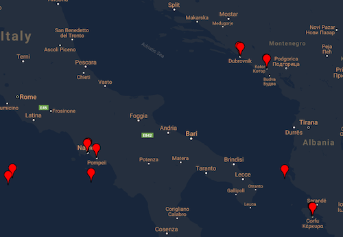

# Plot Moves data

Plot data from the Moves app on a map.

## Getting Started

Clone or download this repository.

### Prerequisites

* Working Python installation.
* Moves CSV file with at least the columns Latitude, Longitude and Date

### Installation
* Put CSV filename with name 'places.csv' in data folder

## Usage

### Heatmap

* Run moves_heatmap.py
* Open my_map_heatmap.html in your browser (located in main application folder)

### Markers and routes
With routes

Without routes

* Run moves.py
* Open my_map.html and my_map_no_routes.html in your browser (located in main application folder)

## Author

* [Coen de Vente](https://github.com/coendevente)

## License

This project is licensed under the MIT License.

## Acknowledgments

* https://github.com/vgm64/gmplot
